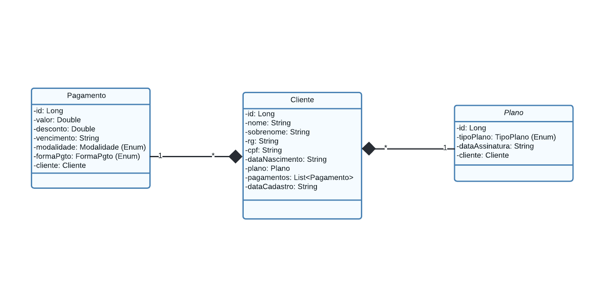
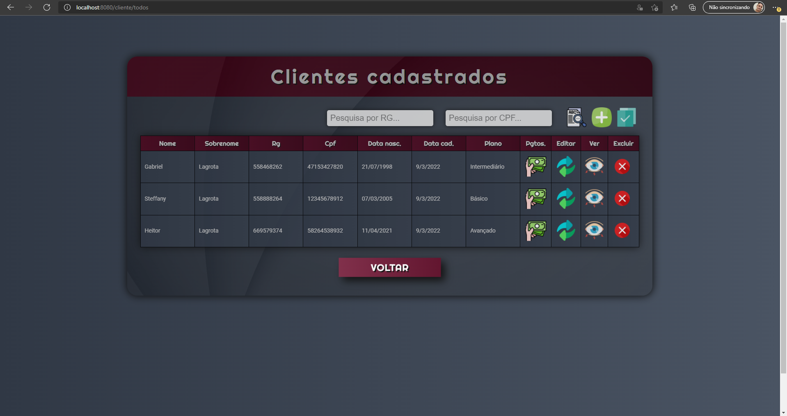

# Academia-Spring
- Sistema desenvolvido em Java Spring boot que tem como objetivo oferecer uma plataforma de gestão para academias.
- App rodando: https://academia-cartage-api.herokuapp.com/

# Funcionalidades

- Realizar matrícula de novos alunos
- Realizar alterações cadastrais em alunos existentes
- Controle sobre as mensalidades dos alunos
- Aplicação de descontos de acordo com a modalidade de pagamento
- Seleção de planos por categorias

# UML INICIAL

# Tela home page

- Botões clicáveis e animados
- Layout simples e direto
- Oferece a estrutura inicial de navegação pelo sistema

# Tela cadastro cliente

- Possibilita o cadastro de um novo cliente
- Layout intuitivo
- Valida os campos de entrada para que não haja erros nas entradas do usuário ou inconsistências na persistência do JPA
- Container de warning aparece para notificar se houve ou não sucesso com o cadastro do cliente

# Tela Listagem Clientes

- Lista todos os usuários cadastrados no sistema
- Possibilidade de buscar usuário por RG e CPF
- Possibilidade de visualizar os pagamentos do cliente, editar o cliente, visualizar as informações do cliente e excluir o cliente
- Tela aumenta de acordo com a quantidade de clientes cadastrados

