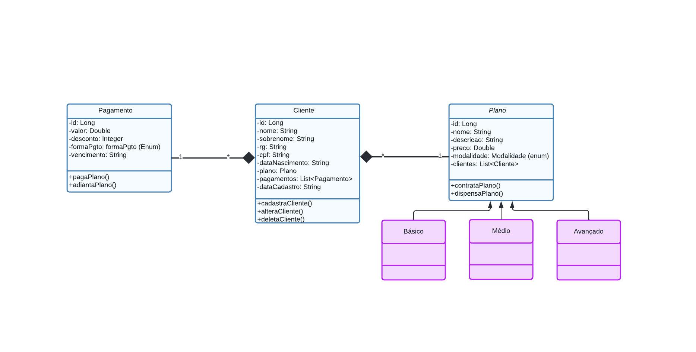
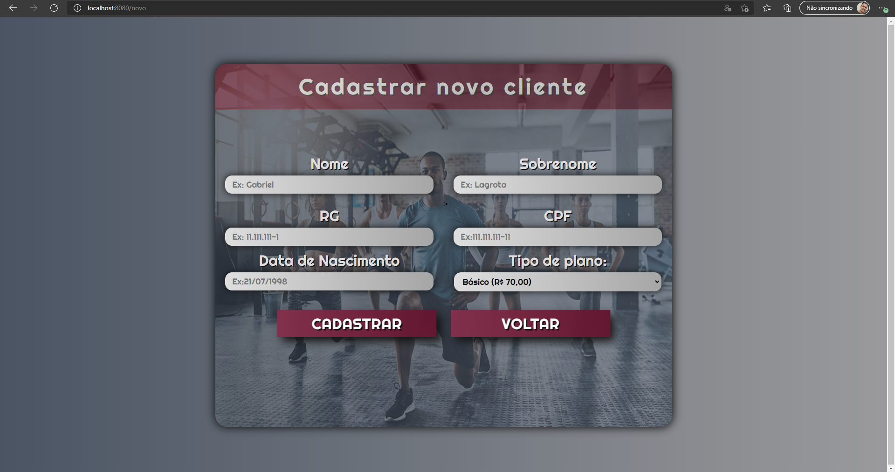

# Academia-Spring
Sistema desenvolvido em Java Spring boot que tem como objetivo oferecer uma plataforma de gestão para academias.

# Funcionalidades

- Realizar matrícula de novos alunos
- Realizar alterações cadastrais em alunos existentes
- Controle sobre as mensalidades dos alunos
- Aplicação de descontos de acordo com a modalidade de pagamento
- Seleção de planos por categorias

# UML INICIAL

# Tela home page

# Tela cadastro cliente
